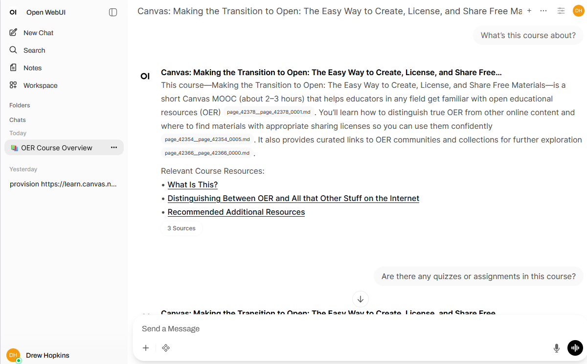

# Open Canvas Pipeline

Turn your Canvas course into a structured, searchable assistant inside [Open WebUI](https://docs.openwebui.com/).

[Open WebUI](https://docs.openwebui.com/) is a friendly, self-hosted interface for working with LLMs. This project plugs your **Canvas** course into that world: instead of digging through modules, files, and announcements, you can just *ask questions* like “What’s due this week?” or “What is Homework 1 actually asking for?”

Behind the scenes, the Open Canvas Pipeline:

- Connects to your Canvas course
- Pulls down the content it’s allowed to see
- Converts it into a searchable knowledge base
- Spins up a **course-specific chat model** you and your students can talk to

So your workflow becomes:

> Provision a course → wait a bit → chat with it.

---

<!-- 📸 Optional: replace this with a real screenshot or diagram -->

---

## What you’ll be able to do

When you’re done setting this up, you’ll be able to:

- **Provision** a course-specific chat model from a Canvas course URL  
- **Ask questions** like “What’s due this week?” or “What is Homework 1 about?”  
- **Keep things up to date** by updating the model and course knowledge over time  

---

## Quickstart

1. Run the application with Docker  
2. Configure Open WebUI & Pipelines  
3. Install and configure the Canvas Course Provisioner pipeline  
4. Provision a Canvas course  
5. Chat with your course

If you need help getting API keys, see:

- **Open-WebUI Key (required):** [Get a Open-WebUI Key](docs/open-webui-api.md) 
- **Canvas API key (required):** [Get a Canvas API key](docs/canvas-api-key.md)  
- **OpenAI API key (optional):** [Get an OpenAI API key](docs/openai-api-key.md)

---

## 1. Run the Application with Docker

Docker uses a **compose file** (`docker-compose.yaml`) to define and run multiple services together. In this case, it starts:

- **Open WebUI** – the main interface you’ll use  
- **Pipelines** – the background service that powers course ingestion and automation  

If you’re new to Docker or need help installing it, see:  
👉 [Docker setup & basics](docs/docker-install.md)

### 1.1 Download the compose file

Download `docker-compose.yaml` from this repository:

- https://github.com/Pris-mo/Open_Canvas_Pipeline/blob/main/docker-compose.yaml

Save it in a new folder on your computer (for example, `Open_Canvas_Pipeline`).

---

### 1.2 (Optional) Add your OpenAI API key

If you’d like OpenAI models available when the app starts, you can add your API key.  
(See [Get an OpenAI API Key](docs/openai-api-key.md) for more details.)

Open `docker-compose.yaml` and find:

- Replace it with:

`- OPENAI_API_KEY=your_key_here`

Example:

`- OPENAI_API_KEY=sk-proj-123abc`

This step is optional, but highly recommended if you want to simplify your setup process. The application will still run without it.

---

### **1.3 Start the application**

Open a terminal in the folder containing `docker-compose.yaml`, then run:

`docker compose up -d`

The `-d` flag runs everything in the background.

The first time you run this, Docker will download and set everything up.  
 This can take several minutes.

---

### **1.4 Open the web interface**

Once the containers are running, open your browser and go to:

* [http://localhost:3000](http://localhost:3000)

You should see the Open WebUI interface. If it is not loading, please know that it can take 5-10 minutes to initalize the first time you run the container. 

---

### **1.5 If something seems stuck**

You can check what’s happening behind the scenes by viewing logs:

`docker logs -f open-webui`

or

`docker logs -f pipelines`

---

### **1.6 Stop the application**

To shut everything down:

`docker compose down`

---

## **2\. Configure Open WebUI & Pipelines**

Once Open WebUI is running, you’ll configure it so it can:

1. Allow API access

2. Connect to the Pipelines service

3. Install the Canvas Course Provisioner pipeline

At a high level, you will:

1. **Enable API keys in Open WebUI**

2. **Generate an Open WebUI API key**

3. **Add a Pipelines connection**

   * URL: `http://pipelines:9099/v1`

   * Bearer token: `0p3n-w3bu!`

4. **Install the Canvas pipeline from GitHub**

    * `https://github.com/Pris-mo/Open_Canvas_Pipeline/blob/main/canvas_course_provisioner.py`

5. **Fill in the pipeline settings**

   * OpenWebUI URL

   * OpenWebUI API key

   * Canvas API key

   * (Optional) OpenAI API key

   * Base model ID (e.g. `gpt-5`)

For a step-by-step walkthrough with screenshots, see:

➡️ [**Configure Open WebUI & Pipelines**](docs/open-webui-pipelines.md)

---

## **3\. 🎉 Setup Complete**

At this point, your Open WebUI instance is:

* API-enabled

* Connected to Pipelines

* Configured with the Canvas provisioning system

You’re ready to begin provisioning courses.

---

## **4\. 🚀 Provision a Canvas Course**

Follow these steps to create a course-specific chat model:

1. Open a **new chat window** in Open WebUI.

2. Select the **Canvas Course Provisioner** model.

   * If you don’t see it, use the search bar to find it.

  
Show screenshot

  ![][image25]

Send a message in this format:

 `Provision <Canvas Course URL>`  
 **Example:**

 `Provision https://www.instructure.com/courses/1234`

3. Wait for the process to complete.

   * You can monitor progress directly in the chat.

   * Once finished, your course model will be ready to use.

---

## **5\. 💬 Chat With Your Course**

After provisioning is complete:

1. Open a **new chat window**.

2. Select your course-specific model.

   * Naming format: `Canvas:<Course Name>`

3. Ask questions about your course.  
    Examples:

   * “What’s this course about?”

   * “What am I supposed to do in HW1?”

   * “When is the midterm?”

---

For advanced options like customizing the model behavior or updating the course knowledge base, see:

* **For More Info on Customizing the model and knowledge** → [Customizing the model and knowledge](docs/customizing-model-and-knowledge.md) 

[image25]: docs/imgs/image25.png  